# Knowledge Management System — UML Diagrams

> **Tech Stack:** React 19 (Vite) · Node.js/Express 5 · MongoDB/Mongoose · JWT (httpOnly cookie) · Multer · Tailwind CSS

---

## 1. System Architecture Diagram

### 1a — Three-Tier Overview

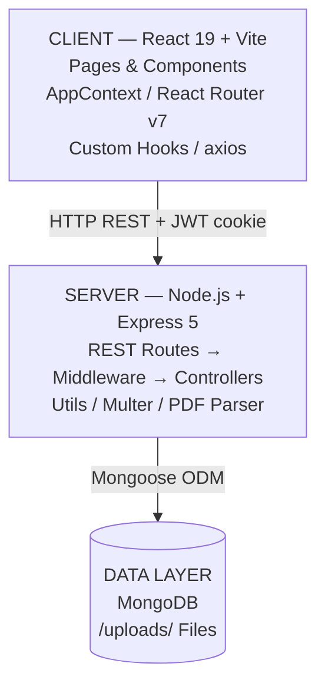

### 1b — Server Internal Pipeline

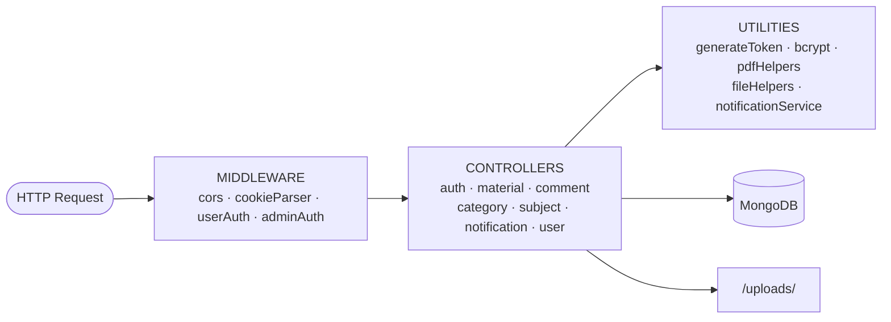

---

## 2. Entity-Relationship (ER) Diagram

#### 2a — Entity Relationship Overview

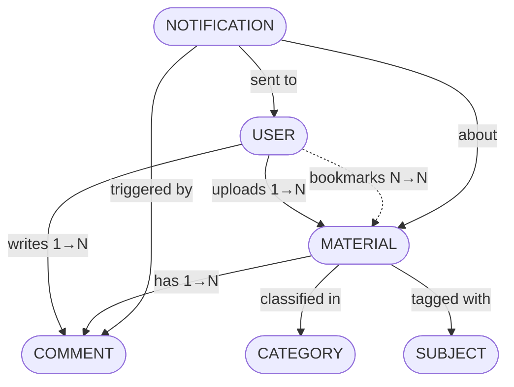

#### 2b — Entity Attributes

| Entity | Key Fields |
|---|---|
| **USER** | _id (PK) · name · email · password · role (student\|teacher) · isActive · bookmarks[ ] |
| **MATERIAL** | _id (PK) · title · description · subject · category · type (PDF\|VIDEO\|IMAGE) · fileUrl · contentText · uploadedBy (FK) · downloads · views · commentsCount |
| **COMMENT** | _id (PK) · material (FK) · author (FK) · parent (FK, self-ref) · content |
| **NOTIFICATION** | _id (PK) · recipient (FK) · actor (FK) · material (FK) · comment (FK) · type (material_comment\|comment_reply) · isRead |
| **CATEGORY** | _id (PK) · name |
| **SUBJECT** | _id (PK) · name |

---

## 3. Use Case Diagram

#### 3a — Student Use Cases

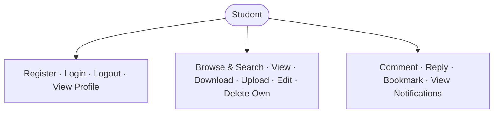

#### 3b — Teacher Use Cases

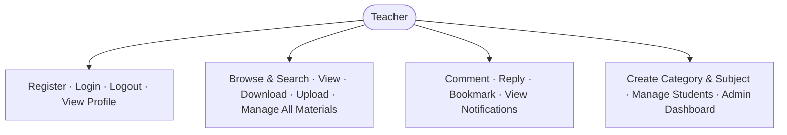

---

## 4. Sequence Diagrams

### 4.1a — User Registration

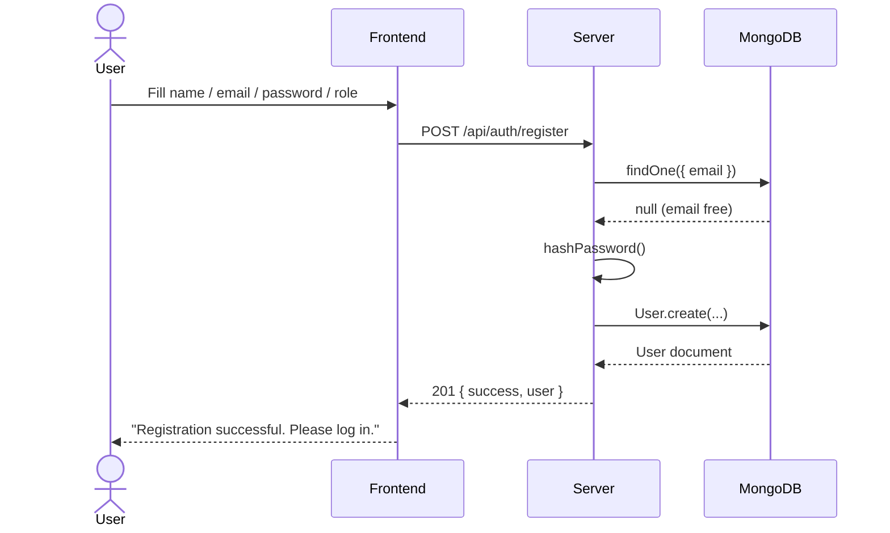

### 4.1b — User Login

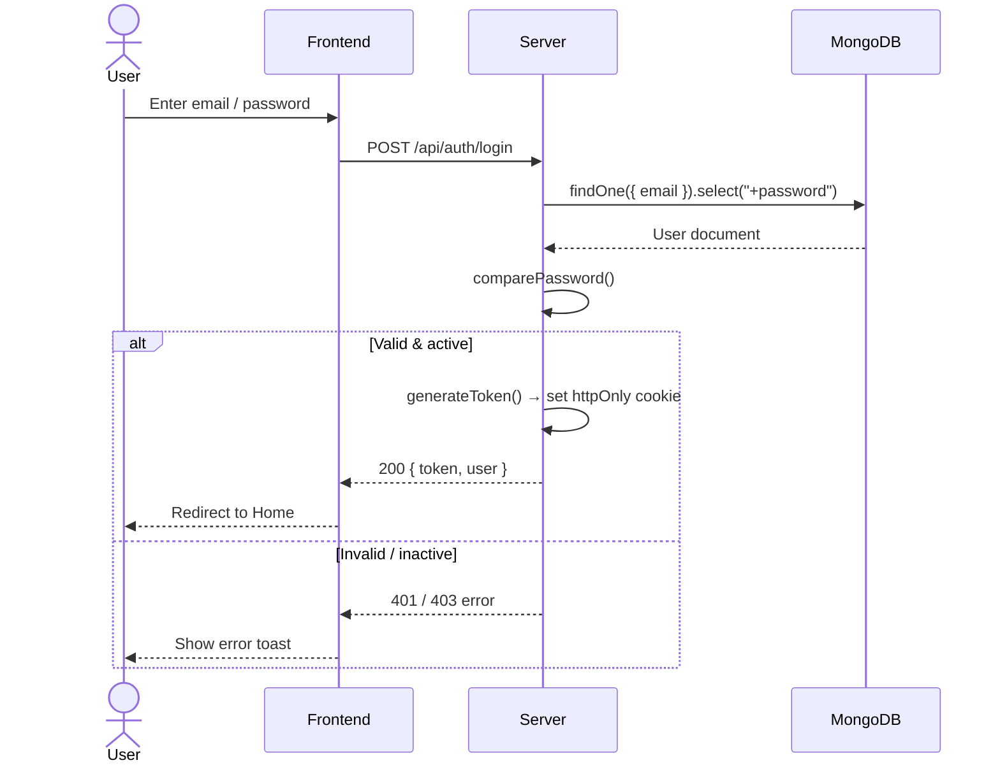

---

### 4.2a — Upload Material (Auth & File Save)

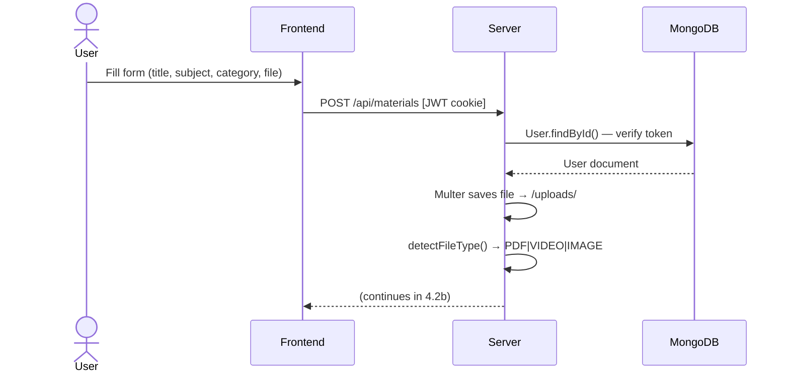

### 4.2b — Upload Material (PDF Extract & Persist)

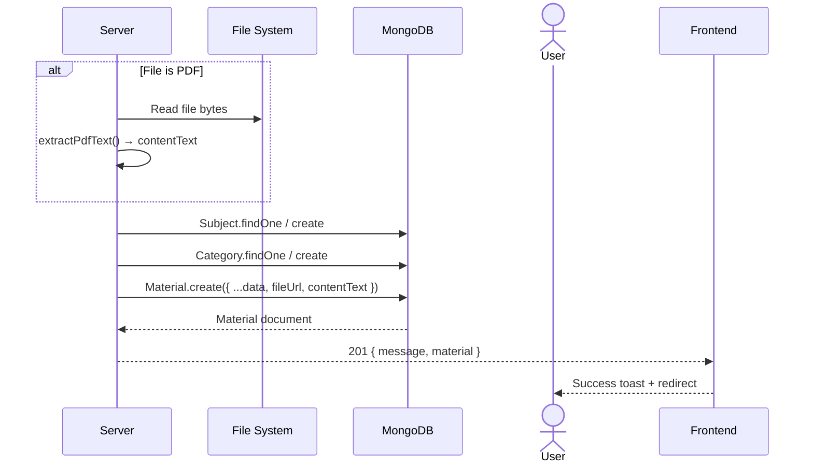

---

### 4.3a — Post Comment

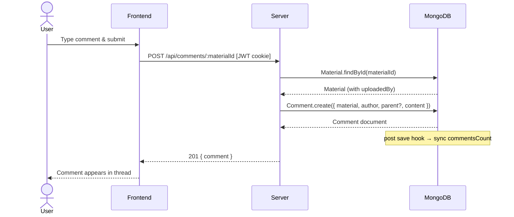

### 4.3b — Trigger Notification

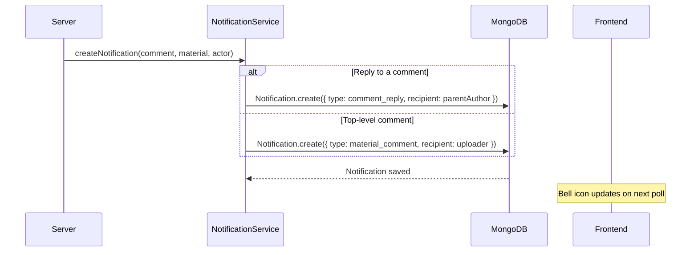

---

### 4.4 — Search Materials

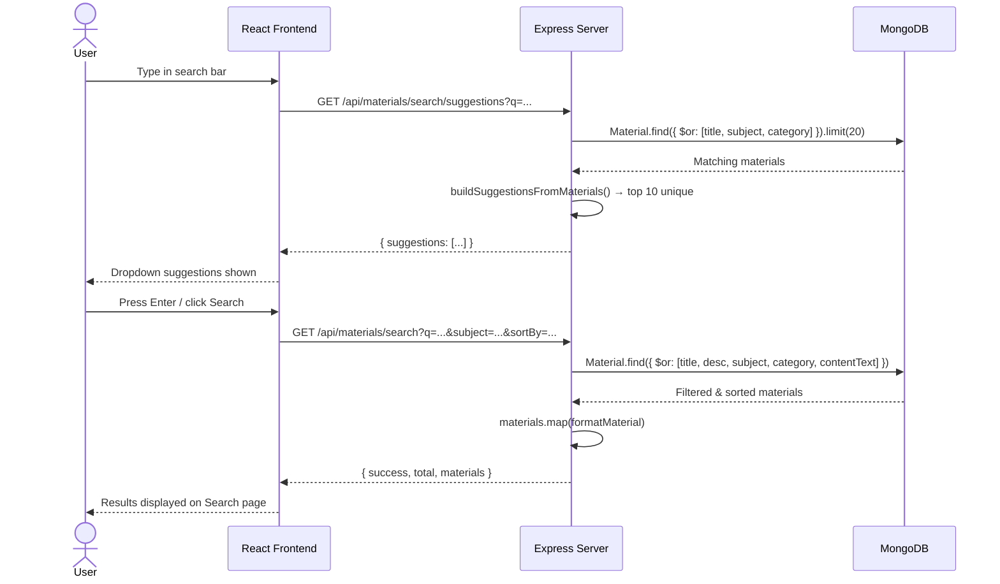

---

### 4.5 — Delete Material (cascade)

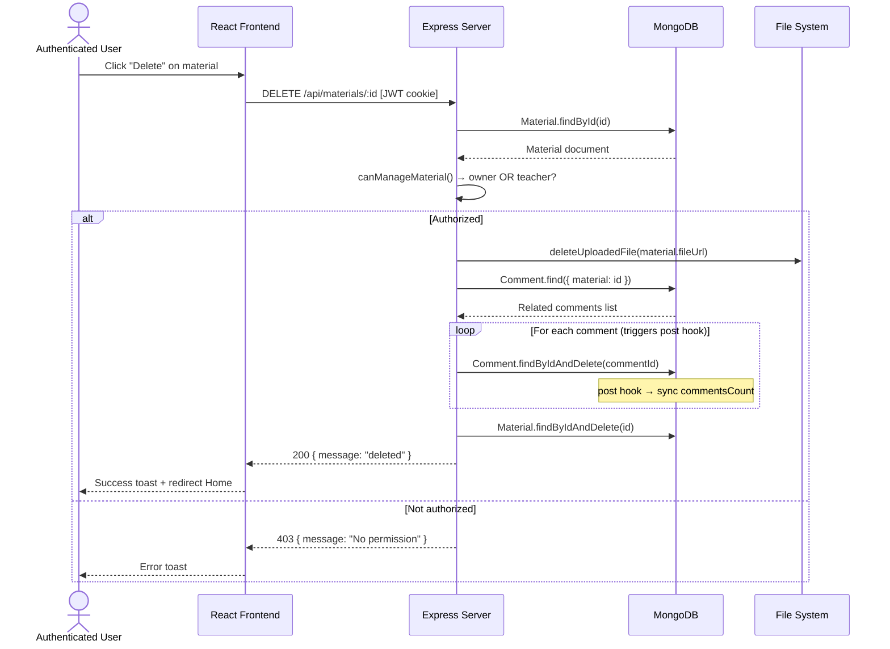

---

## 5. Class Diagram

#### 5a — Data Models

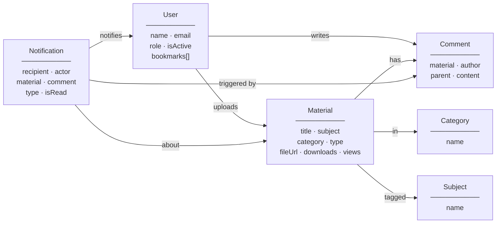

#### 5b — Controllers & Middleware (User Auth)

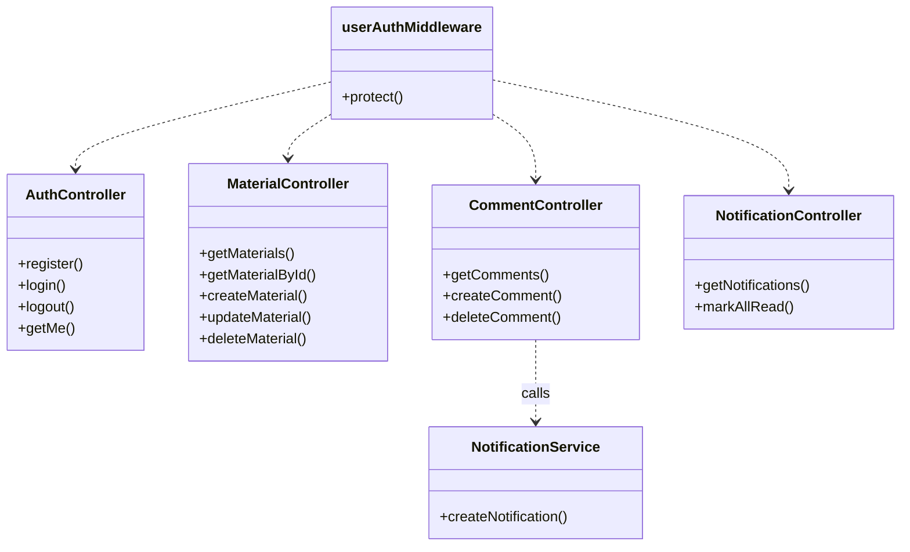

#### 5c — Controllers & Middleware (Admin Auth)

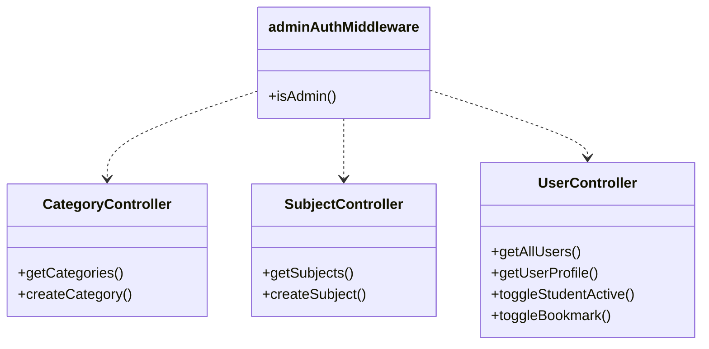

---

## 6. Component & Deployment Diagram

### 6.1 — Frontend Component Tree

#### 6.1a — Entry & Public Routes

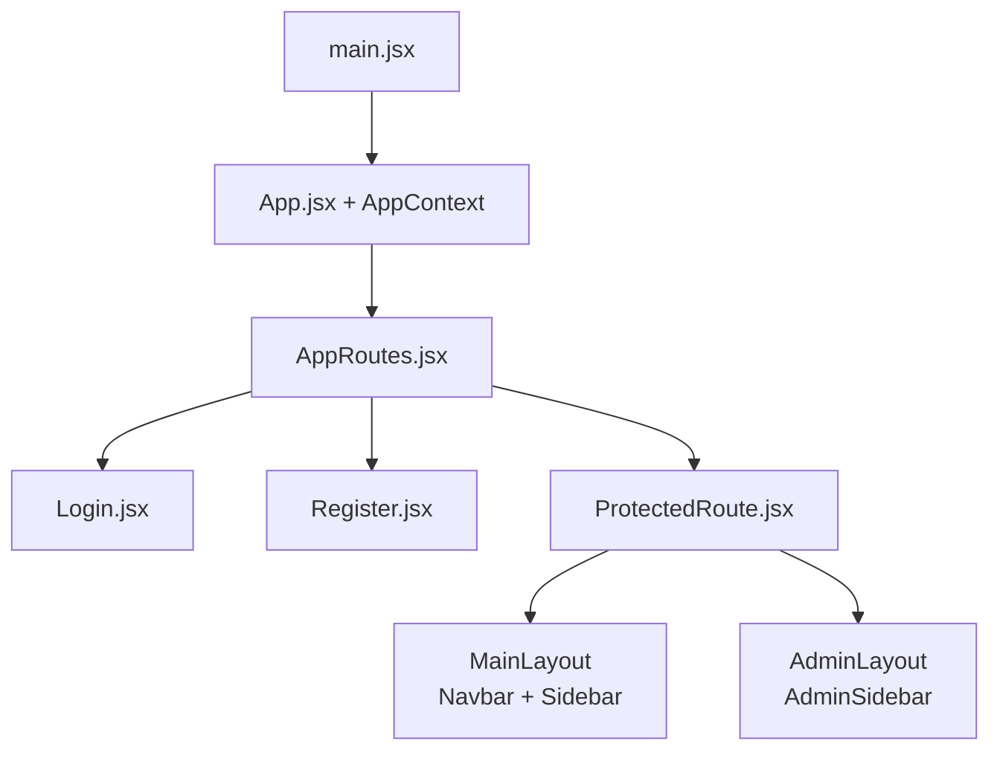

#### 6.1b — Student Pages (under MainLayout)

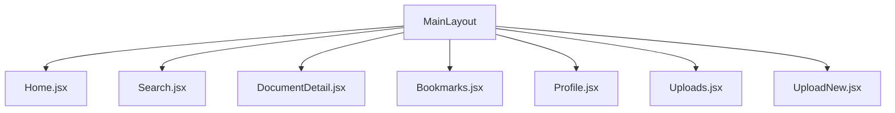

#### 6.1c — Admin Pages (under AdminLayout)

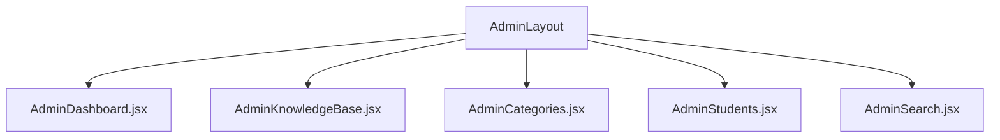

#### 6.1d — DocumentDetail Sub-components

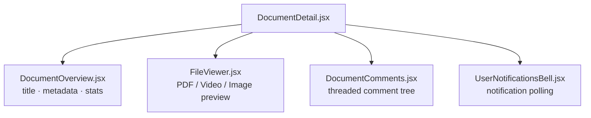

---

### 6.2 — Deployment Diagram

```mermaid
graph LR
    subgraph UserDevice["👤 User's Browser"]
        SPA["React SPA\n(Vite build)"]
    end

    subgraph AppServer["🖥️ Application Server (Node.js)"]
        EXPRESS["Express App\n:5000"]
        MULTER_STORE["/uploads/ directory\n(static files served)"]
        JWT_ENGINE["JWT Engine\n(httpOnly cookie)"]
        EXPRESS --> MULTER_STORE
        EXPRESS --> JWT_ENGINE
    end

    subgraph DatabaseServer["🗄️ Database Server"]
        MONGO["MongoDB\n(Mongoose ODM)"]
        COLLECTIONS["Collections:\nusers · materials · comments\ncategories · subjects · notifications"]
        MONGO --> COLLECTIONS
    end

    SPA -- "HTTPS + CORS\n(credentialed cookie)" --> EXPRESS
    EXPRESS -- "Mongoose queries" --> MONGO
    SPA -- "Static file requests\n/uploads/*" --> MULTER_STORE
```

---

## 7. Data Flow Diagram (Level 0 — Context)

```mermaid
graph LR
    STU["Student"]
    TEA["Teacher / Admin"]

    subgraph KMS["Knowledge Management System"]
        direction TB
        AUTH["Auth Service"]
        MAT["Material Service"]
        COM["Comment Service"]
        NOTIF["Notification Service"]
        USER_SVC["User Service"]
    end

    DB[("MongoDB")]

    STU & TEA -- "register / login" --> AUTH
    STU -- "upload / search / view / download" --> MAT
    STU -- "comment / reply" --> COM
    STU -- "bookmark" --> USER_SVC
    STU -- "read notifications" --> NOTIF

    TEA -- "upload / manage all materials" --> MAT
    TEA -- "comment / reply" --> COM
    TEA -- "manage students" --> USER_SVC
    TEA -- "create categories / subjects" --> MAT
    TEA -- "read notifications" --> NOTIF

    AUTH --> DB
    MAT --> DB
    COM --> DB
    NOTIF --> DB
    USER_SVC --> DB

    COM -- "triggers" --> NOTIF
```

---

## 8. State Diagram — Material Lifecycle

```mermaid
stateDiagram-v2
    [*] --> Uploading : User submits upload form
    Uploading --> FileValidation : Multer receives file
    FileValidation --> TaxonomyResolution : File valid (≤ 20 MB)
    FileValidation --> UploadError : File invalid / too large

    TaxonomyResolution --> PDFExtraction : type == PDF
    TaxonomyResolution --> Persisting : type == VIDEO or IMAGE

    PDFExtraction --> Persisting : Text extracted
    PDFExtraction --> Persisting : Extraction failed (empty contentText)

    Persisting --> Published : Material.create() success
    Persisting --> UploadError : DB error

    Published --> Viewed : User opens detail page (views++)
    Published --> Downloaded : User downloads file (downloads++)
    Published --> Commented : User posts comment (commentsCount++)
    Published --> Bookmarked : User toggles bookmark
    Published --> Editing : Owner / Teacher edits metadata
    Editing --> Published : Material.save() success
    Published --> Deleted : Owner / Teacher deletes

    Commented --> Notified : notificationService creates Notification
    Deleted --> [*]
    UploadError --> [*]
```

---

## 9. Authentication State Diagram

#### 9a — Auth Flow

```mermaid
stateDiagram-v2
    [*] --> Unauthenticated

    Unauthenticated --> Registering : POST /api/auth/register
    Registering --> Unauthenticated : Success / Error

    Unauthenticated --> LoggingIn : POST /api/auth/login
    LoggingIn --> Authenticated : JWT cookie set
    LoggingIn --> Unauthenticated : Invalid / inactive

    Authenticated --> Unauthenticated : Logout / token expired
```

#### 9b — Authenticated Session

```mermaid
stateDiagram-v2
    [*] --> Authenticated

    state Authenticated {
        [*] --> Student
        [*] --> Teacher
    }

    Authenticated --> TokenValidation : Protected route request
    TokenValidation --> Authenticated : Token valid & user active
    TokenValidation --> Unauthenticated : Token expired / not found
    Unauthenticated --> [*]
```
